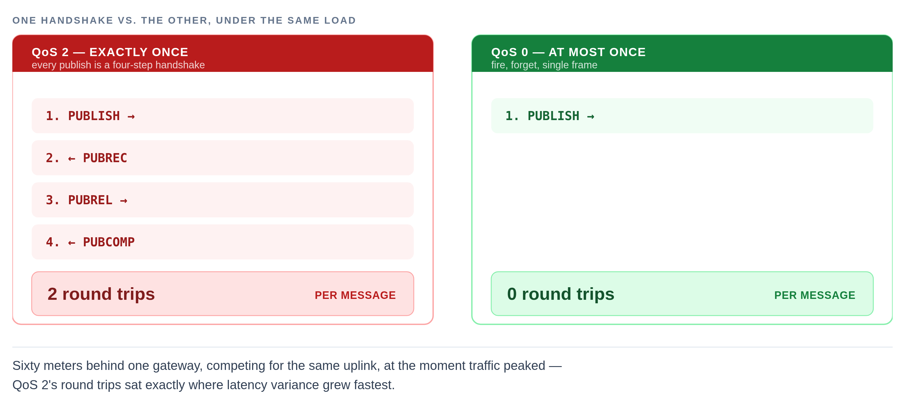

# The Water That Flowed Backwards

*One line of Go turned perfectly valid water-meter readings into impossible graphs — and the safety net we built afterwards turned out to be the same bug in a smaller costume.*

---

You open the dashboard for a flat that's been flagged. The consumption graph dips below zero — the resident, apparently, has un-drunk fifty litres of water — then spikes back up to roughly double the dip, and carries on as if nothing happened.

You've seen this shape before. A flaky meter, you think. Junk data. Move on.

That's exactly what we told ourselves, on a handful of flats, more than once — because the alternative, that our own ingestion pipeline was quietly corrupting good data, seemed far less likely than a flaky meter.

The part that kept the hardware theory alive was the distribution. Only *some* flats were affected. Their neighbours sat on the same gateway, ran the same firmware, published through the same broker, and were written by the same Go binary into the same table. Those were perfectly fine.

That asymmetry felt like proof. It wasn't. It was the clue.

## What the meters actually report

A water meter on this system does not report consumption. It reports a cumulative pulse counter, like a car's odometer, which the backend converts into litres:

```text
reading = (pulseh × 65536 + pulsel) × least_count + offset
```

`pulseh` and `pulsel` are the high and low halves of a 32-bit pulse count, `least_count` is the litres-per-pulse calibration stored against each sensor, and `offset` absorbs meter replacements and manual corrections.

Consumption is never transmitted. It is always *derived*, by subtracting one reading from the one before it:

| Time | Counter | Derived consumption |
|---|---|---|
| 10:00 | 100,000 L | — |
| 10:01 | 100,050 L | 50 L |
| 10:02 | 100,100 L | 50 L |

This is a deliberate and good design. A cumulative counter is self-healing: lose the 10:01 packet entirely and you still get the right total, because `100,100 − 100,000 = 100`. You lose resolution, not correctness. A meter that reported deltas instead — `+50`, `+50` — would lose fifty litres permanently to that same dropped packet.

But the design carries a hard requirement, and it is easy to miss because nothing in the code ever states it.

> **THE UNSTATED CONTRACT**
>
> Subtracting two cumulative counters is only meaningful if they are in the order the meter produced them. Get the order wrong and a perfectly valid pair of readings yields an invalid answer.

## The hypothesis that survived too long

Our reasoning went like this:

> If the software were broken, every meter would be broken. Only some meters are broken. Therefore the problem is not the software.

Every step of that is sound except the premise buried in the first clause — that a software defect must affect all of its inputs uniformly. That is false for any bug whose trigger is environmental. A race condition depends on timing. An ordering bug depends on network jitter. Both will happily correlate with specific hardware, specific locations and specific network paths, producing a pattern that looks exactly like a hardware fault.

> **We had a real correlation. We drew the wrong arrow from it.**

The affected flats genuinely did share something physical — we just assumed that shared property was the cause, when it was only the trigger.

## Following the timestamp

What eventually broke the hypothesis was not a new observation. It was an old one nobody had looked at: the meter packet already told us when the measurement was taken. The payload contract had carried that field since the beginning.

```go
type ThingsPayload struct {
    Data      map[string]interface{} `json:"data"`
    ThingKey  string                 `json:"thing_key"`
    // the meter's own clock, e.g. 1615031018
    TimeStamp uint64                 `json:"time_stamp"`
}
```

So we followed that field from the meter all the way to the graph.


*Figure 1 — Event time is born at the meter and dies four stages later. Everything downstream runs on whichever clock survives that point.*

It did not survive. Inside the MQTT event handler, immediately after unmarshalling and before anything else touched the payload:

```go
err := json.Unmarshal(m.Payload(), &thingsPayload)
if err != nil { /* reject */ }

// the device clock, discarded before anything reads it
thingsPayload.TimeStamp = uint64(time.Now().Unix())

err = thingsPayload.Validate()
```

**For engineers:** subtracting values from a monotonic counter is only valid if you preserve the counter's own total order. Swap in any other order relation — arrival time, insertion time, whatever a downstream system happens to use — and correctness now depends entirely on how closely that substitute order tracks the real one.

> **We replaced the device's clock with our own, before anyone thought to ask which one was right.**

There was a second casualty in those three lines, and it went unnoticed far longer. The payload validator rejects a missing timestamp:

```go
if p.TimeStamp == 0 {
    return apperrors.ErrNoTimeStamp
}
```

But the overwrite ran *before* `Validate()`. By the time that check executed, `TimeStamp` was always a fresh, non-zero server clock value.


*Figure 2 — A guard against a missing device clock, made structurally unreachable by the line written two before it.*

The guard could never fire. We had a validation rule for device clocks that had been unreachable since the day it was written — and because it never fired, it never told us anything was wrong.

## Correct code, operating on the wrong clock

Here is the part I find genuinely instructive. The consumption calculation is not sloppy. It sorts before it subtracts:

```ruby
# refuse to trust row order: sort ascending by timestamp
readings = readings.reject(&:empty?).sort_by { |r| r[0] }

# then subtract each reading from the one after it
readings.each_with_index.map do |reading, i|
  nxt = readings[i + 1]
  [nxt[0], (nxt[1].to_f - reading[1].to_f).round(2)] if nxt
end.compact
```

That code is careful and defensive. It explicitly refuses to trust whatever order the rows came back in, sorts ascending, and only then walks consecutive pairs. Reviewed in isolation, you would approve it. I would approve it.

It sorts by the timestamp column. And the timestamp column held arrival time. So the sort did precisely what it was told — ordered the readings by when our server happened to receive them, with total confidence — and handed that sequence to the subtraction.

It is the same mistake a sorting clerk makes reading a stack of registered-mail receipts instead of the letters inside them: the receipt proves a letter arrived, in the order it was stamped at the counter, and says nothing about which letter was written first.

> **The sort did precisely what it was told. It just wasn't told the truth about the clock.**


*Figure 3 — The same two readings, the same arithmetic, two different clocks. Only the ordering changed.*

Work it through. Reading A is measured at 10:00:01 with counter 100,000. Reading B is measured at 10:01:02 with counter 100,050. B takes a fast path through the network and lands at 10:01:03; A is delayed and lands at 10:01:10.

Sorted by arrival, the stored sequence is `100,050` then `100,000`, and the subtraction gives `100,000 − 100,050 = −50 L`. The next reading along, 100,100, then produces `100,100 − 100,000 = +100 L`.

That is the exact signature we had been staring at: a negative dip followed by a spike of roughly double the magnitude. The meter never reported negative water. Our sort order manufactured it, and the spike was simply the pipeline paying back the litres it had briefly borrowed.

## Why it worked for years

The line was wrong from the day it was written. It did not *become* wrong — the environment changed around it.

When every message takes roughly the same time to travel from meter to server, arrival order and measurement order are the same sequence. Using the wrong clock produces the right answer, consistently, for as long as that holds. The bug needed **variance** in latency, not latency itself. A uniformly slow network would have been perfectly safe.

**For engineers:** the trigger here was variance in the gap between two clocks' orderings, not the size of that gap — a correctness invariant that depends on a statistical property of the environment rather than a worst-case bound is not really an invariant at all.

Two things eroded that. Density grew to around sixty meters behind a single gateway, which meant bursts of near-simultaneous publishes competing for one uplink. And the broker was running at QoS 2, which makes every publish a four-step handshake.



*Figure 4 — QoS 2 spends two full round trips proving delivery. Neither round trip says anything about order.*

> **DELIVERY IS NOT ORDERING**
>
> QoS 2 guarantees a message arrives exactly once. It promises nothing about the order in which independently published messages are processed — and the handshake providing that guarantee was itself inflating the latency variance that broke our ordering assumption.

Which finally answers the question that had protected the hardware theory for so long. The affected flats were the ones on unstable links, where jitter was large enough to reorder arrivals relative to measurements. The correlation with physical location was real all along. It was a correlation with the trigger, never with the cause.

## Three changes, one root cause

The fix bundled three changes, and it is worth being precise about which one actually closed the bug, because they get conflated constantly.

**QoS 2 → 0**, on publish and all four subscribes. What it addressed: handshake overhead and the latency variance it created. Dropping QoS from 2 to 0 removed the round trips and cut broker load meaningfully. It also reduced the variance that had been triggering the reordering, which made the symptom *less frequent*. It did not make it impossible.

**Preserve the device timestamp**, instead of overwriting it. What it addressed: event ordering, the actual defect. This is the one line that closes the bug, on its own, independent of everything else in the release.

**Add a `received_at` column.** What it addressed: observability. It makes the problem measurable, which is not the same as making it disappear.

> **Two of these changes are true, real, and not the fix.**


*Figure 5 — Only the middle card is the fix. The other two are real, and neither one would have closed the bug alone.*

Shipping only the QoS change would have been the worst available outcome — it is the equivalent of calling in extra staff to shorten a checkout queue while the register is still handing back the wrong change: faster, and still wrong. A convincing improvement, a live correctness bug still in place, and evidence now pointing firmly away from the real cause.

The third change is the one I would fight hardest to keep. Storing both clocks costs exactly one column:

```go
// before — one clock, and not the useful one
colNames := append([]string{
    "thing_key", "time_stamp", "offset_value",
}, dataFields...)

// after — event time and arrival time, side by side
colNames := append([]string{
    "thing_key", "time_stamp", "offset_value", "received_at",
}, dataFields...)
```

The migration walks every template-backed hypertable and adds the column idempotently, so existing tables and future ones converge on the same shape:

```sql
ALTER TABLE <each_template_table>
  ADD COLUMN IF NOT EXISTS received_at TIMESTAMPTZ
  DEFAULT NOW();
```

`received_at − time_stamp` is now a directly queryable quantity: which gateways reorder, by how much, and how late a reading can realistically arrive. Before this, that delay was not merely unmonitored, it was *unrecoverable* — the only record of event time had been overwritten in memory before the row was ever written. The evidence was being discarded at the very edge of the system, before anyone downstream could look at it, and that is what made this so hard to see.

## The guard that re-created the bug

The fix did not simply trust the device. Embedded clocks drift, reset, and occasionally report times years away from reality, so the same change added a validation band around the device timestamp:

```go
diff := int64(serverTime) - int64(deviceTime)
if diff < 0 { diff = -diff }

if diff > 1800 {                    // >30 min out of sync
    thingsPayload.TimeStamp = serverTime    // ← and there it is
}
```

This is the obvious, responsible design: use event time when it is credible, fall back to server time when it isn't. I would have written the same thing. It survived review for the same reason the sort did — in isolation, it reads as prudent.

Three months later it was deleted in its entirety.

It is the software equivalent of a smoke detector that, once its battery dies, quietly starts pumping smoke back into the room instead of staying silent.


*Figure 6 — The fallback wrote server time. That is the original defect, scoped down to the readings the guard was built to protect.*

Look closely at what the fallback actually does. When a device's clock is more than thirty minutes off, the guard discards the device timestamp and writes `serverTime` instead. That is the original bug, verbatim, applied to a subset of readings.

And it is the worst possible subset. A meter whose clock has drifted is *persistently* drifted, so it fails the check on nearly every reading — meaning that meter's data gets arrival-time ordering while its neighbours get event time. A device drifting across the thirty-minute boundary is worse still, flipping between the two clocks mid-stream and interleaving both into the same column before the same sort. The result was down spikes: the exact symptom the fix had been written to eliminate.

> **THE FALLBACK WAS THE BUG**
>
> Fallback paths get the least review attention and the thinnest test coverage, precisely because they are meant to be rare. Rare is not the same as harmless. Ask what a fallback *does*, not just when it fires.

Nobody caught it in review, including me. You only see it when you notice that "fall back to server time" and "the root cause" are the same sentence.

So the guard came out. The meter's own timestamp is now written exactly as it arrives, `received_at` records when we saw it, and the graphs have been straight since.

## What transfers

Strip out the water meters and four things remain that I expect to meet again.

- **Delivery is not ordering.** A protocol guarantee about *whether* a message arrives says nothing about *when* it is processed relative to its siblings — and the machinery enforcing that guarantee can be the very thing that breaks the sequence.
- **Correlation with hardware is not evidence of hardware failure.** Any bug with an environmental trigger will correlate with the physical conditions that trigger it. The correlation is real. The causal arrow is the part you have to earn.
- **Data discarded at a boundary cannot be recovered downstream.** The device timestamp was overwritten in memory before the insert. No amount of later analysis could reconstruct it, which is why keeping both clocks is worth far more than the one column it costs.
- **Code can be correct and still be wrong.** The sort was careful. The guard was prudent. Both passed review because both are defensible in isolation, and both were operating on a value that had already been corrupted upstream.

Reviewing a function tells you whether it does what it says. It does not tell you whether what it says is the right thing to do with the data it is actually handed.

The most useful question in the whole investigation was never *what is broken*. It was:

> **What observation would prove our current explanation wrong?**

For the hardware theory, the answer had been sitting in every single packet we received — in a field we overwrote before anyone thought to look at it.
